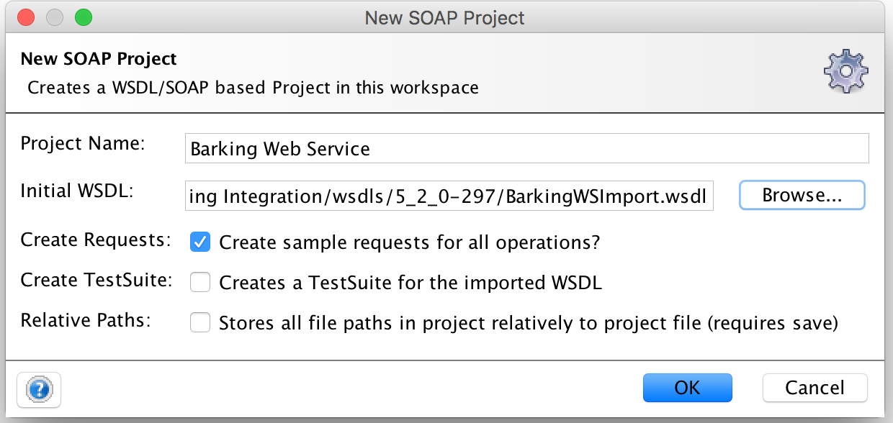
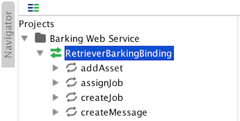
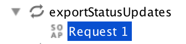
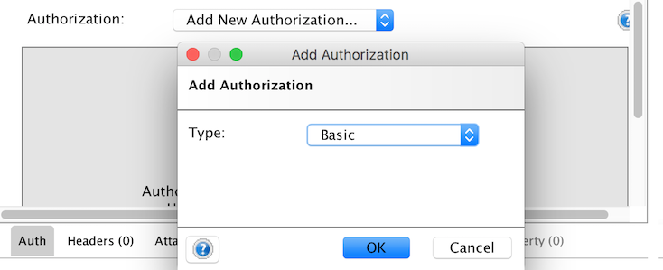
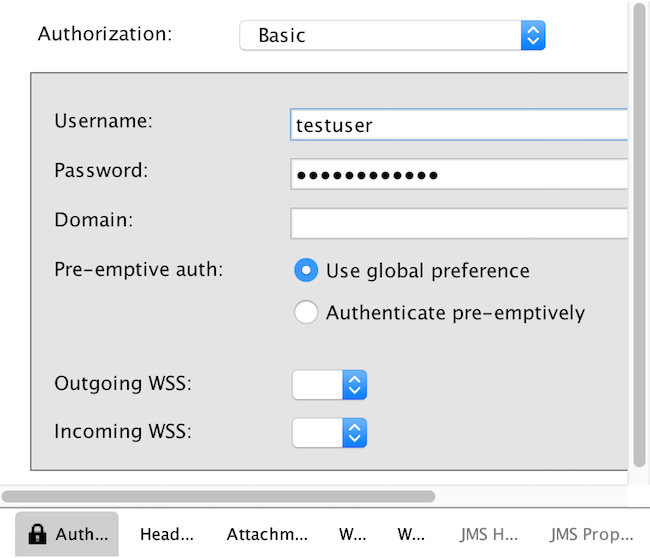

# Using SoapUI with Barking's Web Service

SoapUI is an application built to help testing of SOAP and REST interfaces. It is a great way to independently test that you can connect to the Barking Web Service interface from your network.

The free open source edition can be downloaded here:
https://www.soapui.org/downloads/soapui.html


## Ensure correct Endpoint in WSDL
You would of been given a WSDL and an endpoint to connect to. Make sure that the WSDL is pointing to the correct Endpoint before importing to SoapUI.
Open the WSDL file and check that the "wsdlsoap:address location" towards the end of the file matches the Endpoint that you have been given exactly. If not, please update it to match.

```
<wsdlsoap:address
        location="https://{server-hostname}/{application-path}/integration/webservice?extsys={external-system}"" />
```


## Create SOAP Project
Once SoapUI is installed, you will need to create a SOAP Project.



1. Go to File > New SOAP Project
2. Name the project Barking Web Service or similar 
3. Import the customised WSDL
4. Check Create sample requests for all operations?
5. Leave un-checked "Creates a TestSuite for the imported WSDL" and "Store all file paths in project relatively to project file (requires save)"
6. Hit OK and the project will be created.




## Preparing a Test Request

To validate that you can successfully call the Barking Web Service interface, test with the exportStatusUpdates operation.
Expand the exportStatusUpdates node and open the automatically generated `Request 1`.



You will be presented with a dialog containing a stubbed request. Delete all other tags inside the `<statusUpdate>` XML tag except for `<updatedSince>` and `<export>` and set the values of these to 3600000 and false, respectively. You should end up with XML similar to this:

```
<soapenv:Envelope xmlns:soapenv="http://schemas.xmlsoap.org/soap/envelope/" xmlns:bar="https://test.retriever.com.au/barking">
   <soapenv:Header/>
   <soapenv:Body>
      <bar:exportStatusUpdates>
         <statusUpdate>
            <!--Retrieve the job statuses for the last hour-->
            <updatedSince>3600000</updatedSince>
            <export>false</export>            
         </statusUpdate>
      </bar:exportStatusUpdates>
   </soapenv:Body>
</soapenv:Envelope>
```


## Setup the Authentication

Before submitting the request in the bottom right hand corner of the dialog, hit the Auth tab button and then select the Basic type and hit OK.



This will let you put in the credentials that you would of been given for the specific server that you intend to connect to.

Enter your username and password into the fields provided. Leave other fields as is.



There is no Save or OK button on this tab so just click back on the `Request 1` XML.


## Send the Test Request and Check the Response

You are now ready to make the request. Hit the  green play button in the top left of the dialog. 
If the request was successful, then the response should contain `success` value of "true".
Your response may contain additional data from the one below, if the system you are connecting to, has status updates from the last hour.

```
<soapenv:Envelope xmlns:ns1="https://test.retriever.com.au/barking" xmlns:soapenv="http://schemas.xmlsoap.org/soap/envelope/" xmlns:xsd="http://www.w3.org/2001/XMLSchema" xmlns:xsi="http://www.w3.org/2001/XMLSchema-instance">
   <soapenv:Body>
      <ns1:exportStatusUpdatesResponse>
         <result>
            <success>true</success>
            <errorCode>0</errorCode>
            <errorMsg>No Errors</errorMsg>
            <txId>201709260000000004</txId>
         </result>
      </ns1:exportStatusUpdatesResponse>
   </soapenv:Body>
</soapenv:Envelope>
```